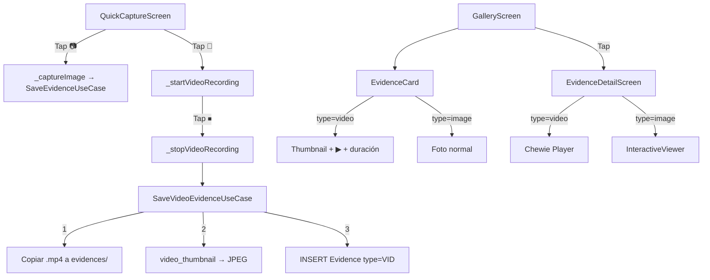

# Walkthrough: Captura de Clips de Vídeo

## Resumen

Se ha implementado la funcionalidad completa de grabación de vídeo para el portfolio de estudiantes. Los docentes ahora pueden capturar tanto fotos como vídeos desde la misma pantalla de captura, con reconocimiento facial previo y reproducción inline en la galería.

## Archivos Modificados

### Nuevos
| Archivo | Descripción |
|---------|-------------|
| [save_video_evidence_usecase.dart](file:///d:/eduportfolio-mobile/lib/features/capture/domain/usecases/save_video_evidence_usecase.dart) | Use case: copia vídeo a almacenamiento, genera thumbnail, guarda en BD |

### Modificados
| Archivo | Cambios |
|---------|---------|
| [pubspec.yaml](file:///d:/eduportfolio-mobile/pubspec.yaml) | Añadidas dependencias `video_player`, `chewie`, `video_thumbnail` |
| [capture_providers.dart](file:///d:/eduportfolio-mobile/lib/features/capture/presentation/providers/capture_providers.dart) | Provider para `SaveVideoEvidenceUseCase`, estados de grabación |
| [quick_capture_screen.dart](file:///d:/eduportfolio-mobile/lib/features/capture/presentation/screens/quick_capture_screen.dart) | Dos botones (📷+🎥), indicador REC, overlay estudiante, `enableAudio: true` |
| [evidence_card.dart](file:///d:/eduportfolio-mobile/lib/features/gallery/presentation/widgets/evidence_card.dart) | Overlay ▶ y badge duración para vídeos |
| [evidence_detail_screen.dart](file:///d:/eduportfolio-mobile/lib/features/gallery/presentation/screens/evidence_detail_screen.dart) | Reproductor Chewie para vídeos, gestión de ciclo de vida |
| [evidence_preview_dialog.dart](file:///d:/eduportfolio-mobile/lib/features/review/presentation/widgets/evidence_preview_dialog.dart) | Reproductor Chewie para vídeos en revisión |
| [evidence_review_card.dart](file:///d:/eduportfolio-mobile/lib/features/review/presentation/widgets/evidence_review_card.dart) | Overlay play + badge duración en tarjetas de revisión |

## Arquitectura

## Decisiones Clave

- **`enableAudio: true`**: Ahora la cámara siempre se inicializa con audio. No afecta a las fotos.
- **Reconocimiento facial**: Se desactiva durante la grabación (el estudiante ya fue identificado). Se reactiva al parar.
- **Overlay de estudiante**: Visible durante toda la grabación con icono 🎥 + nombre.
- **Lifecycle de vídeo**: Los controladores de Chewie/VideoPlayer se disponen correctamente al cambiar de página y al salir de la pantalla.

## Verificación

### Compilación
- ✅ `flutter analyze` — Sin errores nuevos (los 2 errores existentes son en `settings_providers_test.dart`, preexistentes)
- ✅ `flutter pub get` — Dependencias resueltas correctamente

### Testing Manual Pendiente
El usuario debe probar en dispositivo real:
1. Capturar un vídeo (botón 🎥 → indicador REC → botón ⏹)
2. Verificar thumbnail y badge de duración en la galería
3. Reproducir el vídeo desde la galería (controles play/pausa)
4. Asignar estudiante/asignatura a un vídeo
5. Revisar un vídeo sin estudiante desde la pantalla de revisión
